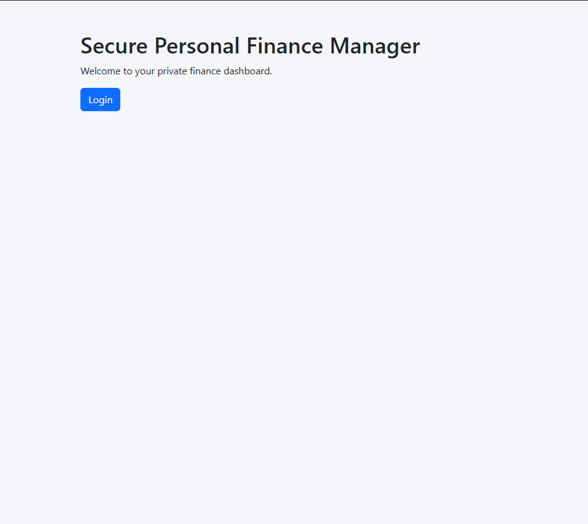
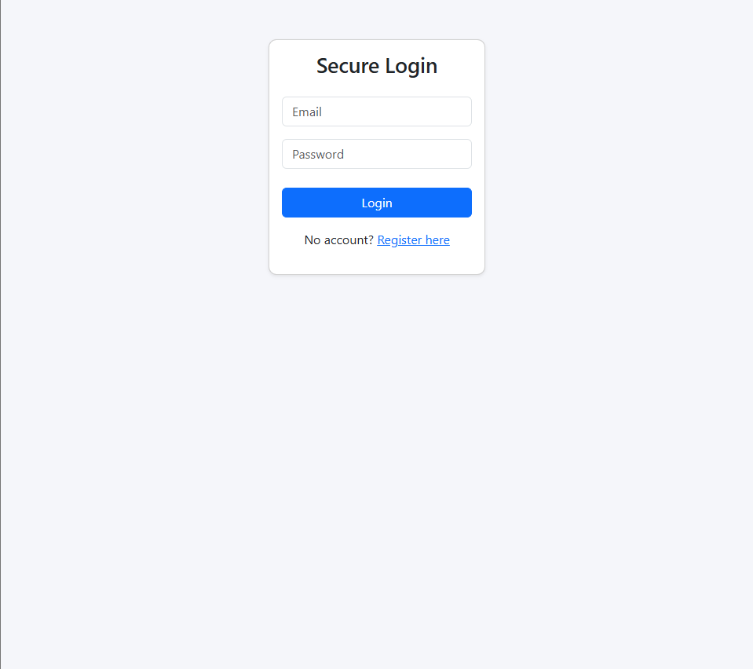
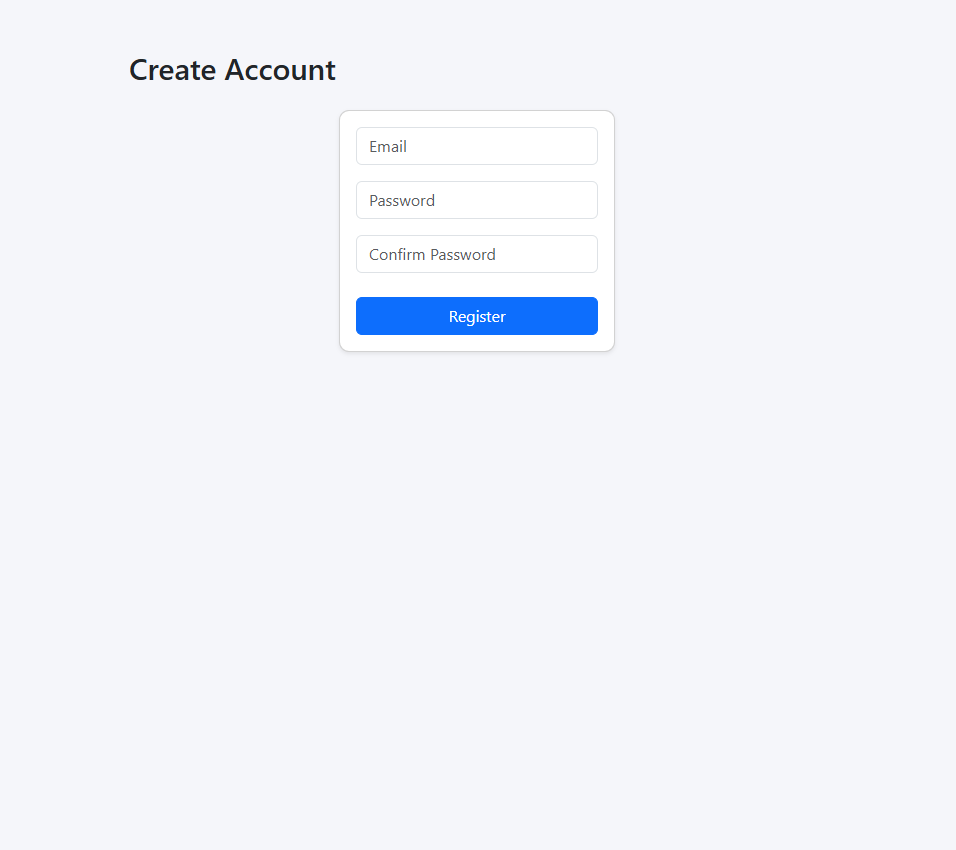
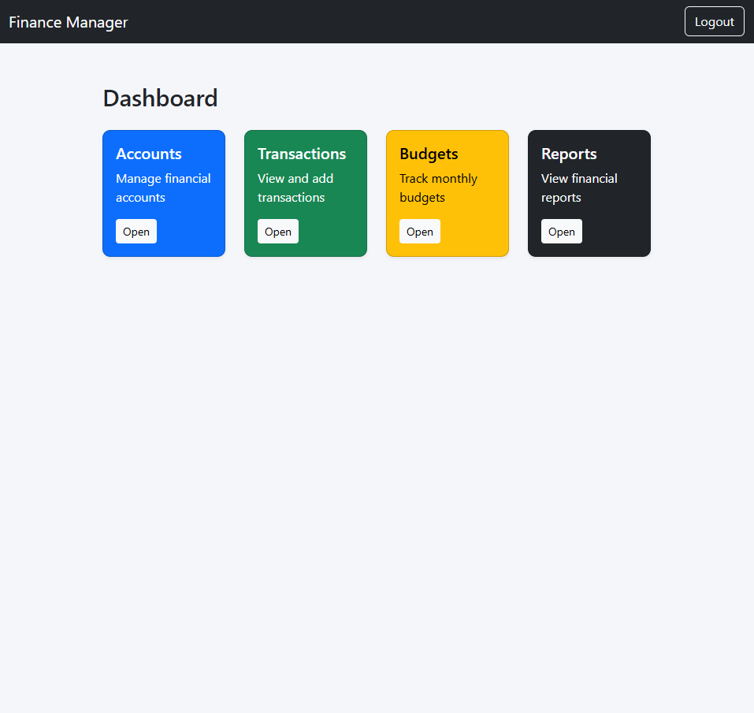
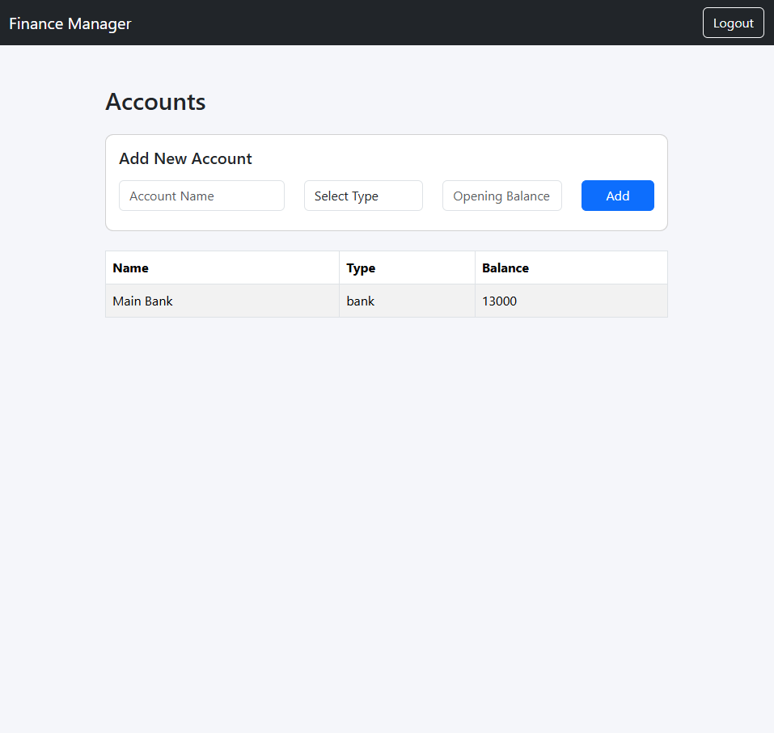
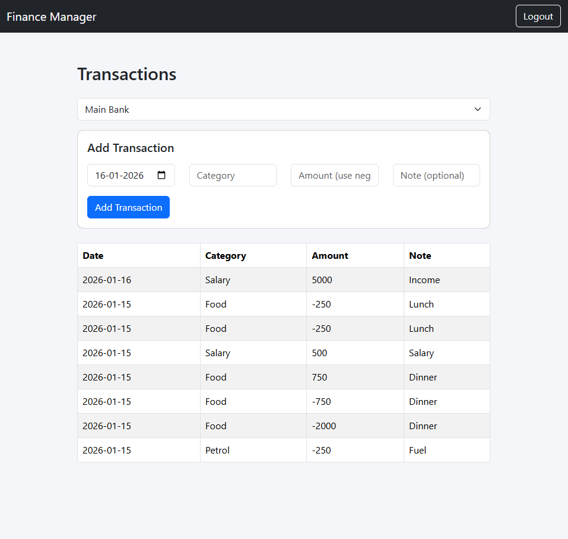
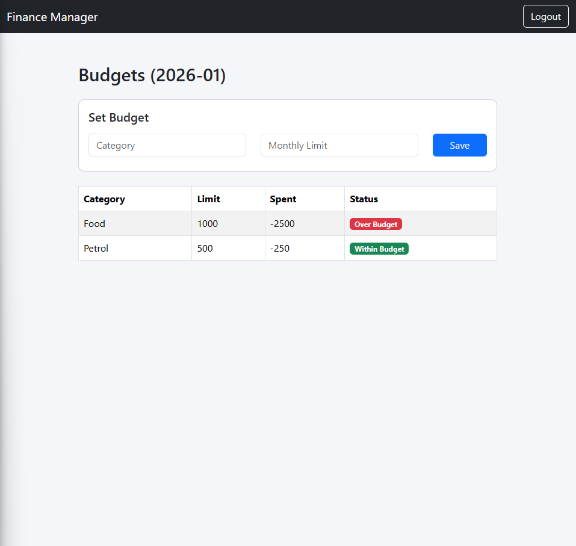
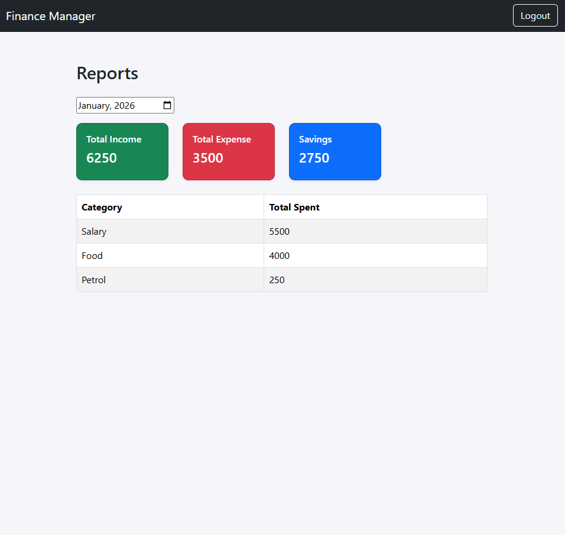

# Secure Personal Finance Manager

A secure, encrypted personal finance management system built in Core PHP.  
Designed to demonstrate backend architecture, encryption, authentication, and clean MVC-style separation.

---

## Key Features

- User registration and authentication
- Secure password hashing
- Session hardening and CSRF protection
- Encrypted storage of balances and transactions (AES-256)
- Account management
- Transaction tracking with automatic balance updates
- Monthly budgets with overspending detection
- Financial reports with category breakdown
- CSV & PDF export
- Application logging and audit trails
- Flash-based user messaging
- Clean layered architecture

---

## Tech Stack

- Core PHP 8+
- MySQL (PDO)
- Bootstrap 5

No frameworks. No shortcuts.

---

## Architecture Overview

- Models: Database access only  
- Services: Business logic + encryption  
- Core: Auth, Validator, Encryption  
- Views: Pure presentation  
- Front Controller: Routing only  

---

## Security Highlights

- Passwords stored using `password_hash()`
- Encrypted financial data using AES-256-CBC
- Random IV per encryption
- CSRF protection tokens
- Session ID regeneration on login
- Activity timeout
- Audit logging

---

## Setup Instructions

1. Clone repository  
2. Create MySQL database  
3. Import provided SQL schema  
4. Configure `.env` file  
5. Run project from `/public` directory  
6. Register a new user  
7. Start using the application

---

## Screenshots

### Home

### Login

### Register

### Dashboard

### Accounts

### Transactions

### Budgets

### Reports

---

## Author

Arun Rar  